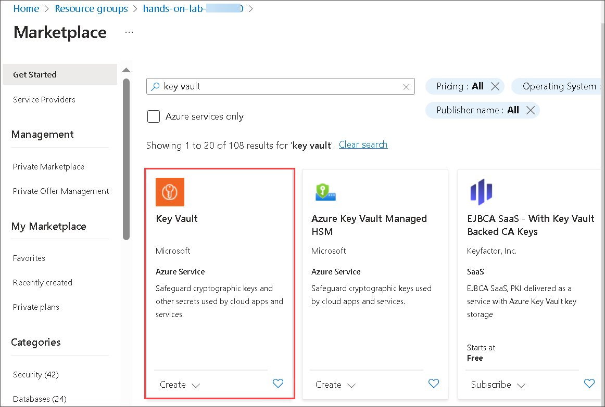
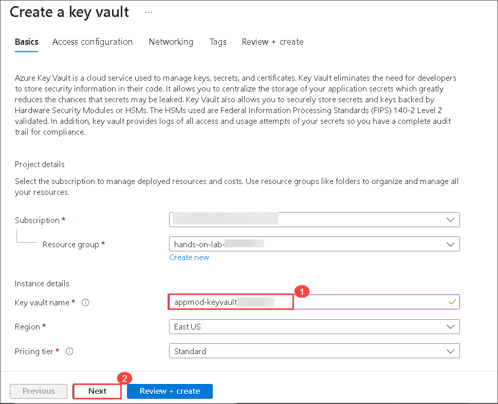
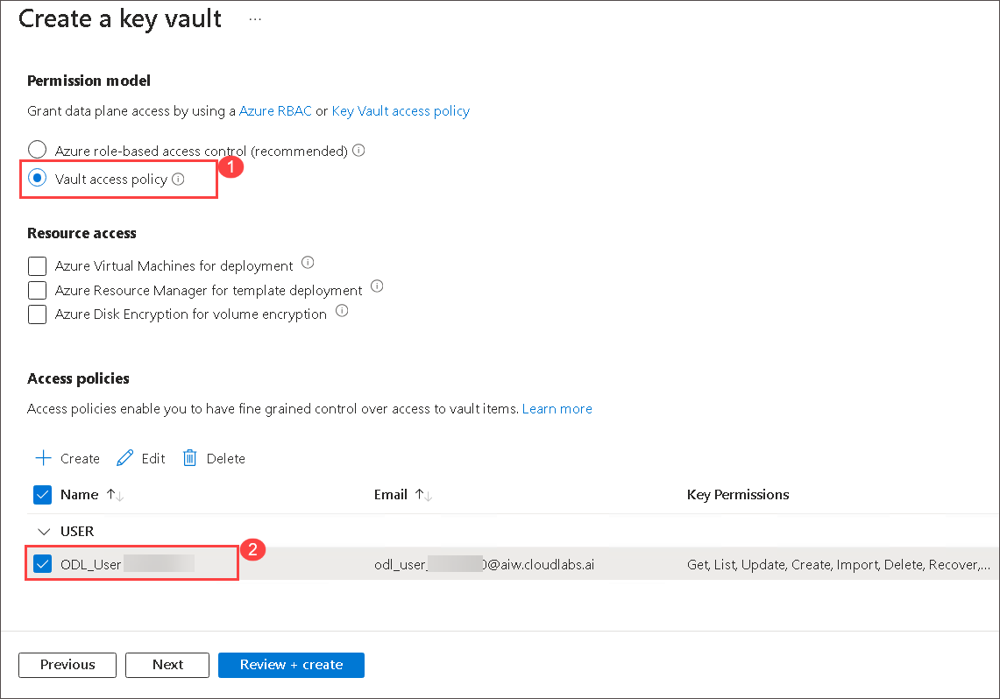
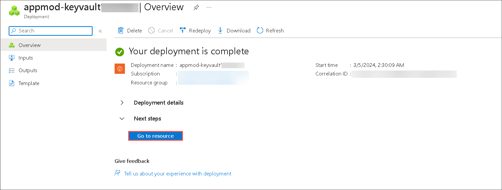
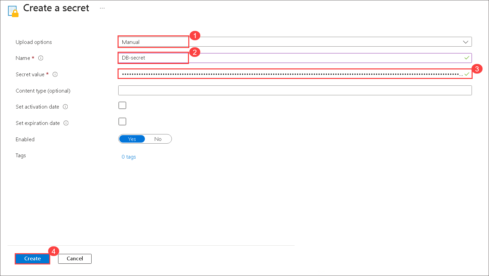
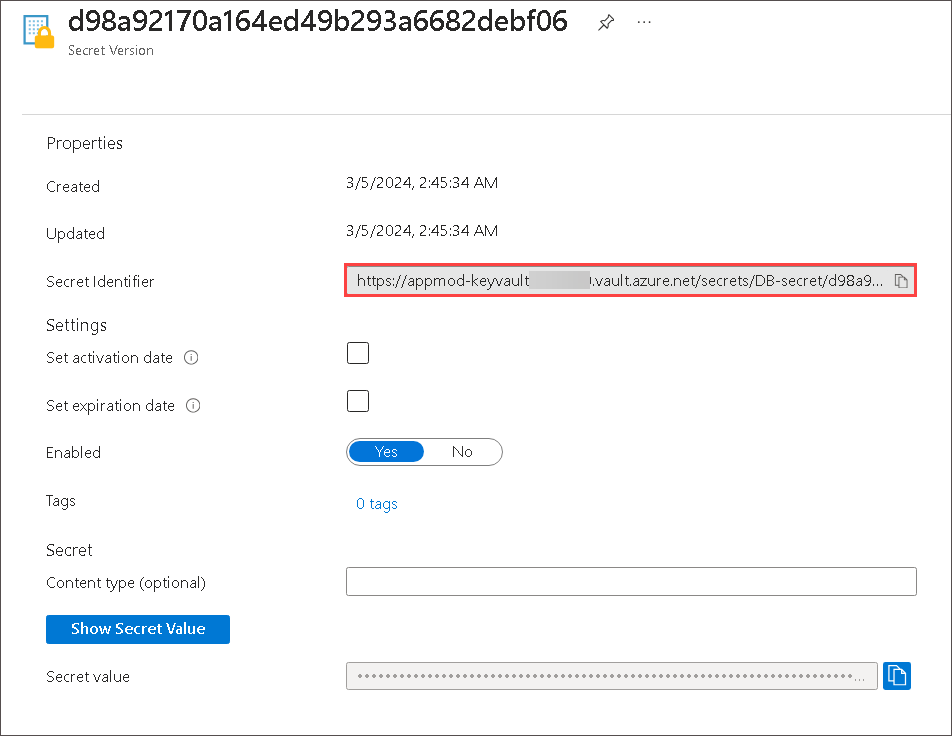
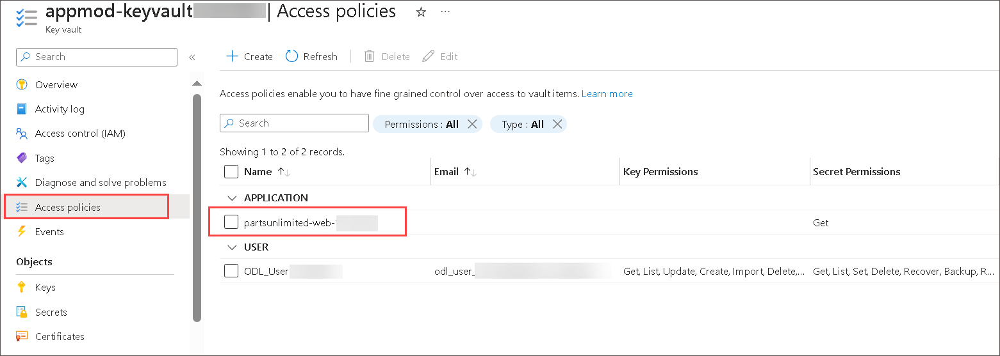
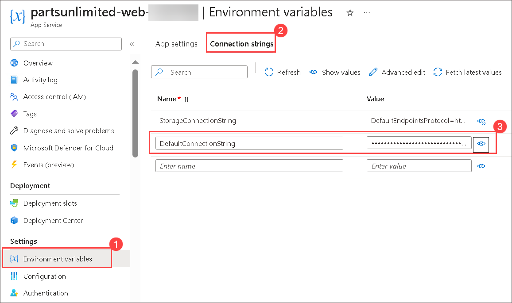
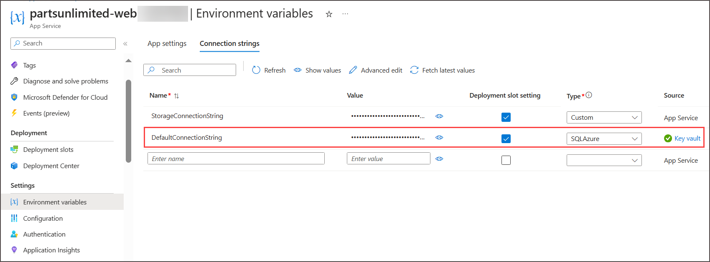

# Exercise 9: Securing web app connection string with Azure Key Vault and Managed Identity (Optional)

Duration: 30 minutes

In this exercise, you'll create a key vault and deploy the Azure web application using a key vault secret. You'll use a system-assigned managed identity to authenticate your Azure web app with an Azure key vault using Azure Key Vault secret.

## Task 1: Setting up Azure Key vault

1. Select your **resource group**. 

   

1. Select **+ Create** inside the resource group to add a new resource.

    
    
1. Type **Key Vault (1)** into the search box and select **Key Vault (2)** from the dropdown.

    

1. Select **Key Vault**
   
   

1. Select **Create** to continue.

   
    
1. On the **Basics** tab of the key vault. Provide the key Vault name as **appmod-keyvault<inject key="DeploymentID" enableCopy="false"/> (1)**, leave all other options as default and click on **Next (2)**.

    

1. On the **Access Configuration** tab of the key vault, select the **Vault Access Policy (1)** in Permission Model and select the **ODL_USER_<inject key="DeploymentID"/> (2)** in Access Policies.

    

1. On the **Review + create** page, review all the options, and click on **Create**.
    
1. After creating the Key Vault successfully, click on **Go to resource**.

    

1. Switch to the **Secrets (1)** Blade and select **+ Generate/Import (2)**.

   
   
1. On the Create secret panel, enter the following details, and click on **Create**.
   
   - **Upload options (1)**: `Manual`
   
   - **Name (2)**: Enter `DB-secret`
   
   - **Value (3)**: Enter the SQL Connection String you copied in Exercise 4, Task 6, Step 3.

     
   
1. Once the secret is successfully created, click on the newly created secret to copy the secret identifier.

   

1. Select **CURRENT VERSION**.

1. On the Secret Version panel, copy the **Secret Identifier** value and paste it into the notepad for future use.

   

   <validation step="9afdf443-db24-4874-b461-54099558122e"/>
   
## Task 2: Create and assign system-assigned managed identity

1. Go back to the resource list and navigate to your **partsunlimited-web-<inject key="DeploymentID" enableCopy="false"/> (2)** App Service resource. You can search for `partsunlimited-web` **(1)** to find your Web App and App Service Plan.

   
   
1. Switch to the **Identity** blade under settings.
   
   
   
1. On **System assigned (1)** managed identity, select **On (2)** and click on **Save (3)**. Click on **Yes** for the **Enable system-assigned managed identity** pop-up.

   
   
1. Once the managed identity is assigned, copy the **ObjectID** and paste it into the notepad.

   
   
1. Go back to the resource group and search for `appmod-keyvault` **(1)** to find your Key Vault and click on it **(2)**.

   
   
1. From the left navigation pane, select **Access policies (1)** and click on **+ Create (2)** to create the access policy for key vault.

   .png)
 
1. Under the Permissions tab of **Create an access policy** panel, select the following:

   - **Configure from template**: Select `Secret Management` **(1)**
   
   - **Secret permissions**: select `Get` **(2)**
   
   - Click on **Next (3)**

     
   
1. Under **Principal** tab, enter the **system assigned managed identity (1)** you copied previously on step 4 and select it **(2)**. Click on **Next (3)**.

   
   
1. On the **Application (Optional)** tab, leave all the values to default and click on **Next**.

   

1. Click on **Create** under the **Review + create** tab.

    
    
1. Once the access policy creation is completed, make sure that the application access policy is listed as shown below.

   
    
## Task 3: Securing the web app connection string with secret

1. Go back to the resource list and navigate to your **partsunlimited-web-<inject key="DeploymentID" enableCopy="false"/> (2)**
App Service resource. You can search for `partsunlimited-web` **(1)** to find your Web App.

   

1. Switch to the **Environment variables (1)** under **Settings** section and then select **Connection strings (2)** tab. Select the connection string with the name **DefaultConnectionString (3)**.

   
   
1. Edit the keyvault secret in the **@Microsoft.KeyVault(SecretUri=Secret_identifier)** format. Replace the **Secret_identifier** with the value you have copied in task 1, step 11. Copy the edited secret value that looks as mentioned below:

    `@Microsoft.KeyVault(SecretUri=https://appmod-keyvault776057.vault.azure.net/secrets/DB-secret/ffd4c9d21f8e4582956ee42b20f74e13)`

     

1. Select **Apply** when you get **Save changes** pop up click on **Confirm**.
   
1. Scroll down to the connection string details and observe that the **DefaultConnectionString** shows the **Key Vault** as the Source.
   
   
   
1. Switch to the **Overview (1)** Blade and select **Default domain (2)** to navigate to the Parts Unlimited website hosted in our Azure App Service using Azure SQL Database.

    
    
    
    
    
   **Note:** You may see a different image on the web app while accessing it, as there are multiple images moving on the web app page.

   <validation step="8adaf042-d391-4663-84bb-9157355a9c47" />
   
 ## Summary
 
In this exercise, you have covered the following:
  
   - Created an Azure key vault.
   - Deployed the web application using a key vault secret.
